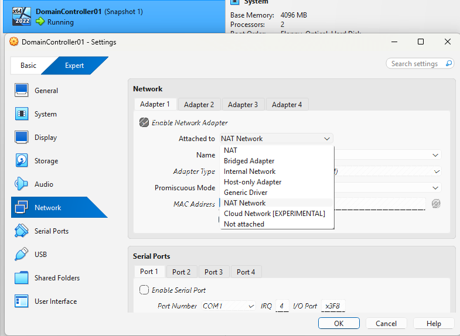
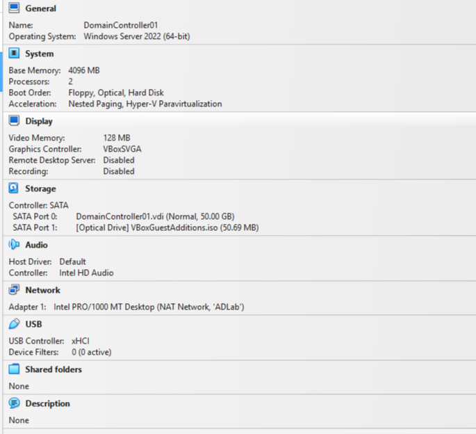
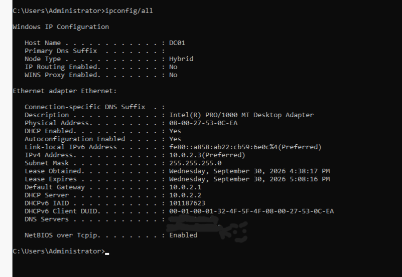
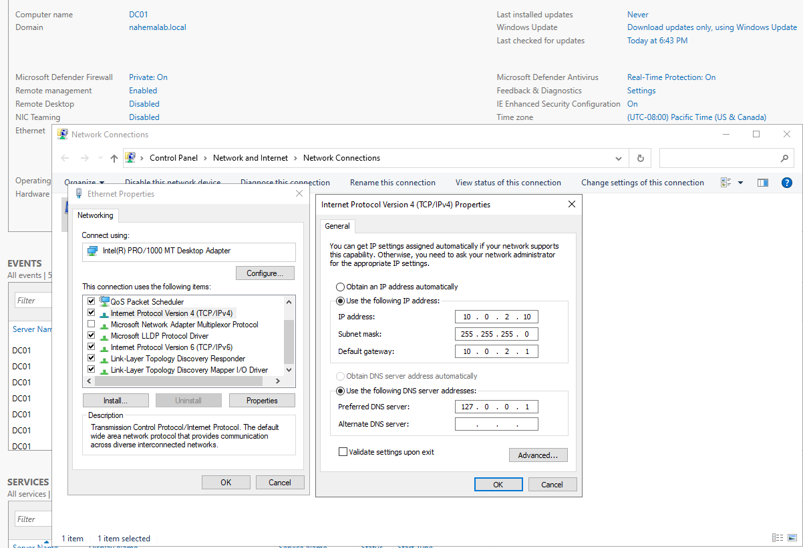
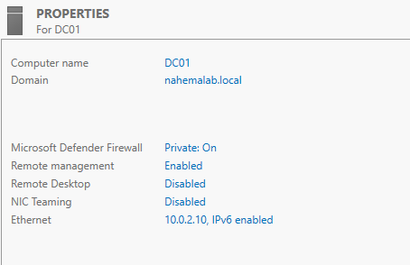
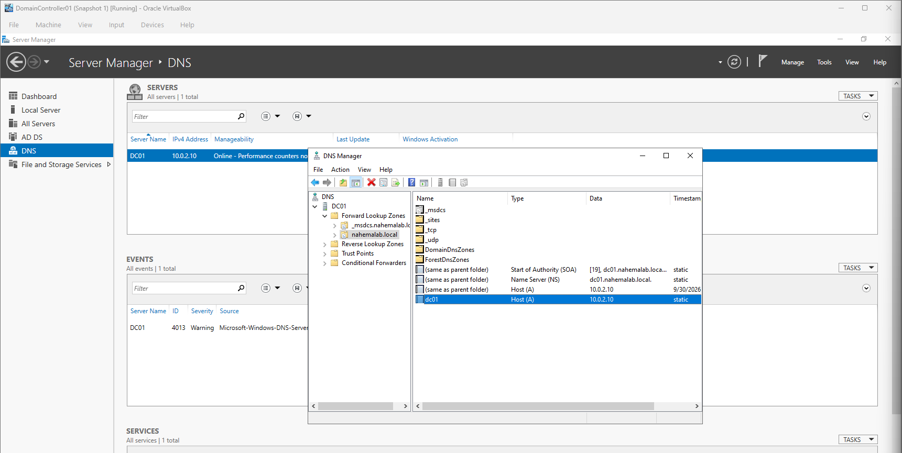
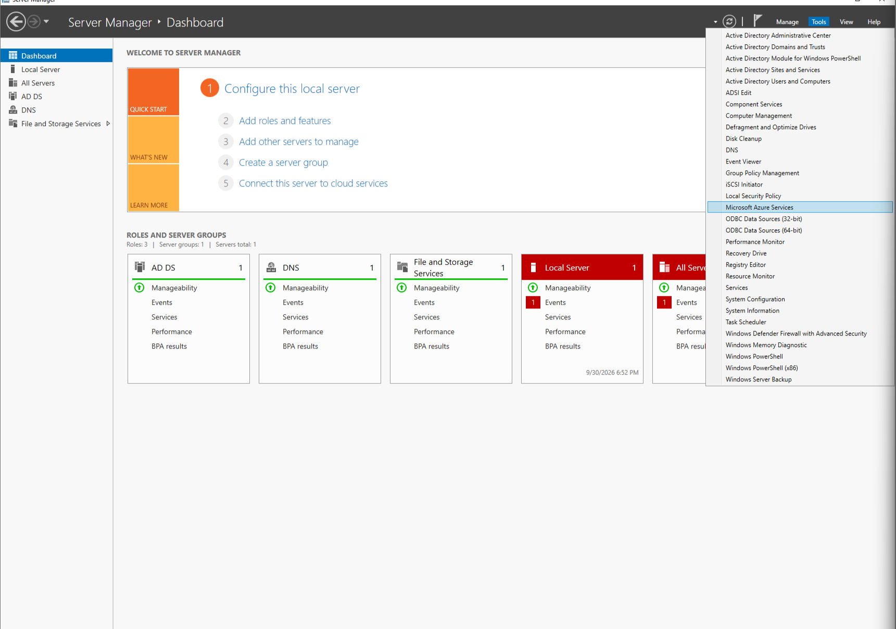

# Part 1: Building the Server

## Dilemma: We want to practice real company IT work, but there's no "company." No server, no network, no users.
## Objective: Get a Windows Server running on its own lab network, ready to become the boss of our fake company.

Steps

1) First we need to create a NAT Network in VirtualBox, which I named "ADLab." This gives our VMs their own private network where they can see each other, while still borrowing my laptop's internet.

2) Now that we have a network, we need a server to put on it. I made a new VM called DC01 (Domain Controller 1) with 4 GB RAM, 2 CPUs, and a 60 GB disk, which is enough to run smoothly while leaving my 16 GB laptop room to breathe.

3) Before finishing, we need to uncheck "Proceed with Unattended Installation." The auto install tends to grab the command line only version, and I wanted the normal Windows GUI.

4) Next we plug the server into our network by setting its adapter to NAT Network "ADLab," then install Windows Server 2022 Standard (Desktop Experience).

5) Windows gives the server a random name, so we rename it to DC01. Real companies name servers by their job, and renaming after it becomes a Domain Controller is a headache.

# Part 2: Giving the Server a Permanent Address

## Dilemma: DC01 got its IP (10.0.2.3) from VirtualBox's DHCP. That address is borrowed and can change, and if it does, every PC looking for the server gets lost.
## Objective: Give DC01 a static IP so it always lives at the same address.

Steps

1) First we need to see how DC01 is currently getting its address.
   On the DC01 Command Prompt:
   terminal> ipconfig /all
   This shows DHCP Enabled: Yes, a 30 minute lease, and DNS pointing at my internet provider. So the address is borrowed.

** You might notice a little face drawn over the DNS Servers line. Those were my home internet provider's DNS addresses, passed through by VirtualBox. Not a real risk, but I covered them anyway since good habit is to never share details about your real network online. The 10.0.2.x addresses are safe to show since they're private and only exist inside my VirtualBox lab.

2) Now we need to give DC01 its own permanent address. Under Ethernet > Properties > IPv4, I switched to "Use the following IP address" and entered:
   IP: 10.0.2.10 (an easy number to remember, away from the ones VirtualBox uses)
   Subnet mask: 255.255.255.0
   Gateway: 10.0.2.1 (VirtualBox's mini router, the exit door to the internet)
   DNS: 127.0.0.1 (means "ask myself," since DC01 is about to become the DNS server)

3) Great, now we check if it actually stuck by running ipconfig /all again. DHCP Enabled is now No, the lease lines are gone, and DNS points to 127.0.0.1.

** Servers get static IPs because other things need to FIND them. Laptops use DHCP because nobody needs to look them up, they just go out and connect. Easy way I remember it: "if people come to it, it's static. If it goes to things, it's DHCP."

** DNS vs gateway confused me at first. DNS is the phonebook (looks up google.com's address), the gateway is the front door (actually carries the traffic out). You need both.

** The subnet mask 255.255.255.0 means the first three numbers (10.0.2) are the network and only the last one changes per device. That's why DC01 had to stay in 10.0.2.x.

# Part 3: Turning the Server into a Domain Controller

## Dilemma: DC01 is still just a standalone server. It only knows its own accounts and has no control over any other PC.
## Objective: Create our domain, nahemalab.local, and make DC01 its Domain Controller.

Steps

1) Before any big change, we take a snapshot called "Static IP set, before AD." It's a save point, so if the install breaks things we can roll back in seconds.

2) Now we need to install the Active Directory software itself. In Server Manager > Manage > Add Roles and Features, I installed Active Directory Domain Services. This only installs it, like downloading an app before opening it.

3) To actually create the domain, we click the yellow flag and choose "Promote this server to a domain controller."

4) Since we're building a brand new company from scratch, we pick "Add a new forest" and name the domain nahemalab.local. The .local keeps it internal so it never clashes with a real website.

5) Next we leave DNS ticked so DC01 becomes the phonebook for the domain, and set a DSRM password, which is the emergency recovery key if AD ever breaks badly.

6) We get a warning about DNS delegation, but we can ignore it. That's for linking to a parent DNS server, and our private lab doesn't have one.

7) We leave the default paths, let the prerequisite check pass, and hit install. The server reboots itself when it's done.

8) Great, now we verify it worked. The Local Server page shows Domain: nahemalab.local instead of Workgroup.

** The 3 paths explained: NTDS.dit is the actual AD database (every user and password hash, which is why attackers want it), the logs folder protects against crashes mid change, and SYSVOL is a shared folder that holds Group Policy files for every PC.

9) We also want to confirm DNS got set up. Under Tools > DNS > Forward Lookup Zones, DC01 already registered itself at 10.0.2.10.

** Also noticed a DNS Warning 4013 in the events. Normal on a brand new single DC; DNS just waits for AD to finish loading at startup.

10) Last, we take another snapshot called "Domain created" as our new safe point.

** The Tools menu now has all the admin tools AD gave us: Active Directory Users and Computers, DNS, Group Policy Management, and more. That's where the next part starts.

