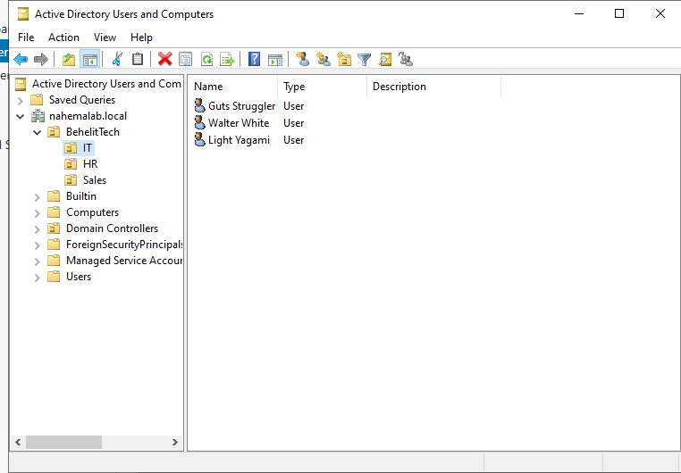
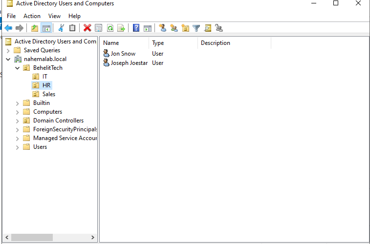
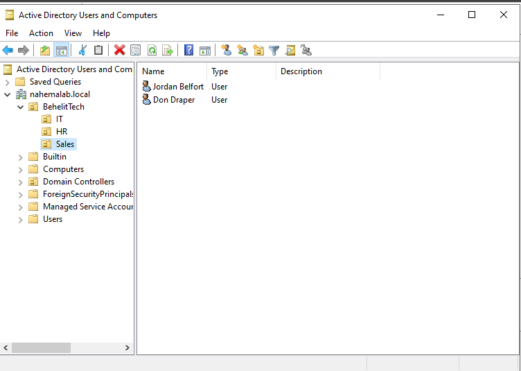
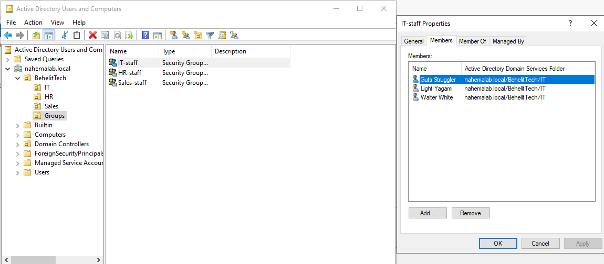
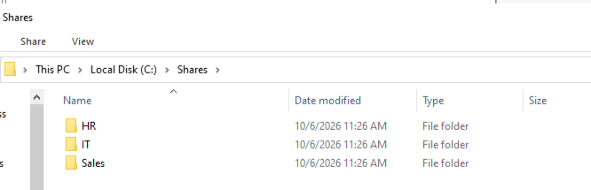
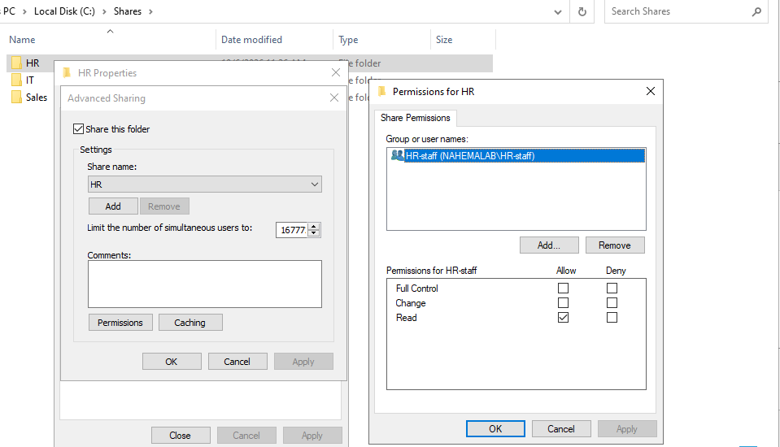
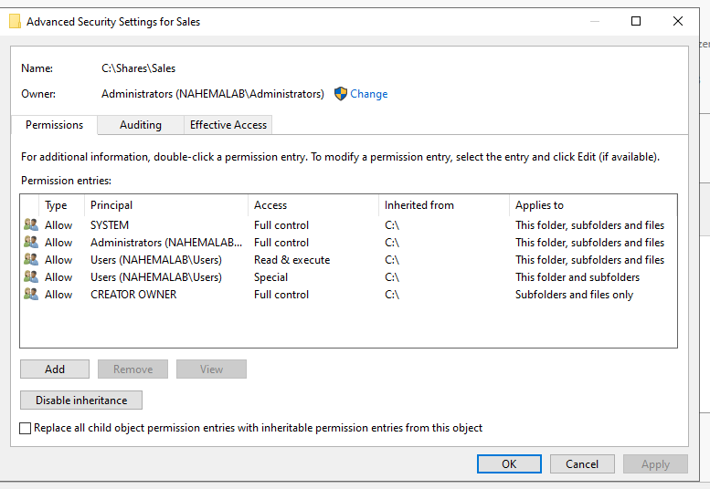
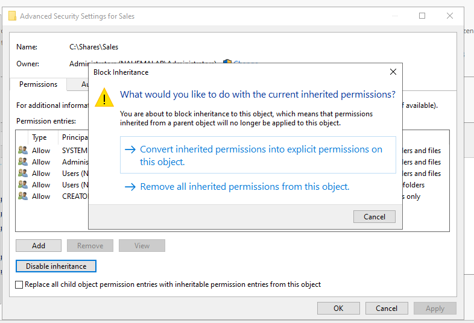
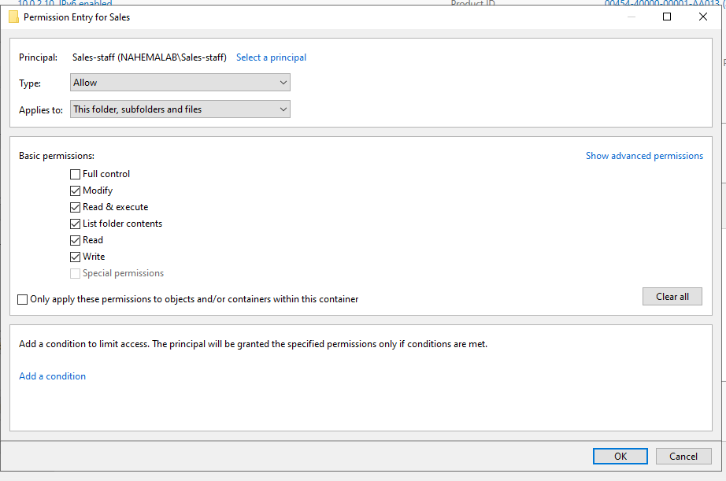
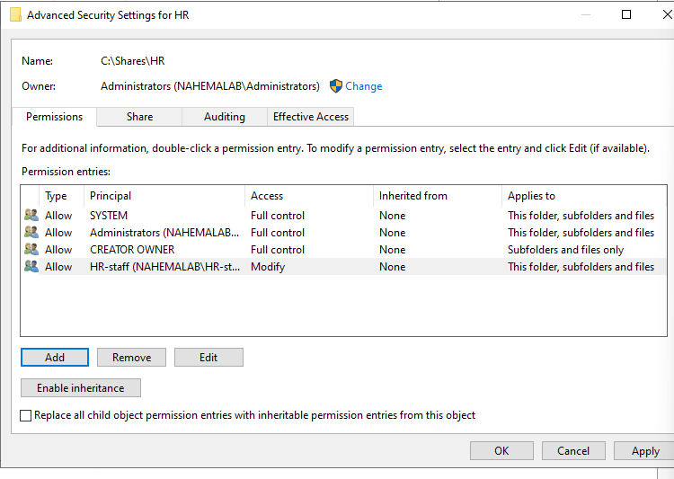

# Part 4: Building the Company Structure

## Dilemma: We have a domain, but it's an empty building. No departments, no employees, nothing organized.
## Objective: Create our company, BehelitTech, with IT, HR and Sales departments and real employees inside them.

Steps

1) First we open Tools > Active Directory Users and Computers. This is the tool help desk opens the most, for creating users, resetting passwords and unlocking accounts.

** Inside nahemalab.local there are default folders like Builtin, Computers and Users. Most of these are "containers," not OUs, and containers can't have Group Policy applied to them. That's why companies build their own OUs. You can tell them apart by the icon: OUs have a little badge, containers are plain yellow folders.

2) Now we make our company OU. Right click nahemalab.local > New > Organizational Unit and name it BehelitTech (yes, from Berserk). I left "Protect from accidental deletion" ticked so nobody wipes out the whole company with one click.

3) Inside BehelitTech we create three department OUs: IT, HR and Sales. I kept these names plain on purpose since any admin should instantly know where things go.

4) Time to hire. Right click a department > New > User. I used the first initial + last name format for usernames (Guts Struggler = gstruggler) since it keeps names predictable, just like real companies do.

5) Every user got a temporary password with "User must change password at next logon" ticked. This is how real onboarding works: IT sets a temp password and the employee picks their own on day one, so IT never knows it.

** The domain rejected my first simple password. Turns out the Default Domain Policy forces at least 7 characters plus a mix of upper, lower, numbers and symbols. I left it on since real companies always have it.

# Part 5: Groups (The Key Cards)

## Dilemma: Everyone sits in the right department, but nothing controls what they can actually access.
## Objective: Create security groups so we can give whole departments access at once.

Steps

1) First we make a Groups OU inside BehelitTech so all our key cards live in one place.

2) Inside it we create IT-staff, HR-staff and Sales-staff, each with scope Global and type Security. Security groups can be given access to things like folders, while Distribution groups are only for email lists.

3) Now we add people to their group. Select everyone in a department, right click > Add to a group, type the group name and hit Check Names, which confirms AD actually found it so you don't add people to a typo.

** OU vs group confused me at first. An OU is WHERE someone lives (their department folder). A group is WHAT they can access (their key card). Same person can be in one OU but many groups.

# Part 6: Department Shared Folders

## Dilemma: Every department needs its own shared drive, and HR files especially shouldn't be open to the whole company.
## Objective: Create a shared folder per department that only that department can open.

Steps

1) On DC01 we create C:\Shares with IT, HR and Sales folders inside.

2) First lock: share permissions (who can get in over the network). Right click the folder > Properties > Sharing > Advanced Sharing > Permissions. I removed Everyone and added only that department's group.

3) Second lock: NTFS permissions (who can touch the files on the disk itself). By default the folder copies its permissions from C:\, which lets every domain user read it.

4) To fix that we go to Security > Advanced > Disable inheritance > Convert inherited permissions. This stops the folder copying C:\ so we can edit it on its own.

5) Then we remove both Users entries and add the department group with Modify, so they can open, edit and save files but not change permissions.

6) Great, now only SYSTEM, Administrators, CREATOR OWNER and the department's group are left.

** NTFS stands for New Technology File System, the way Windows stores files. Its big feature is that every file and folder gets its own lock.

** Windows checks BOTH locks and the stricter one wins. So if the share says Read but NTFS says Modify, the user can only Read. That mismatch is behind the classic ticket: "I can open the file but get access denied when I save."

** Why not just email files around? Shared folders keep company data on company systems, let IT control exactly who sees what, get backed up centrally, and access disappears the moment someone is offboarded.
