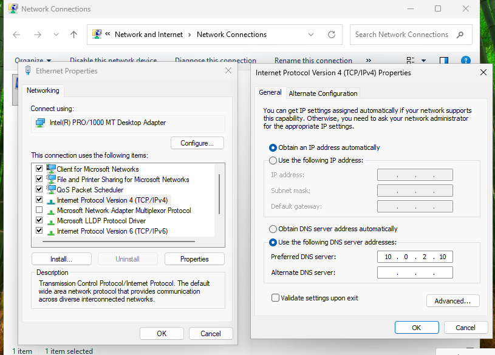
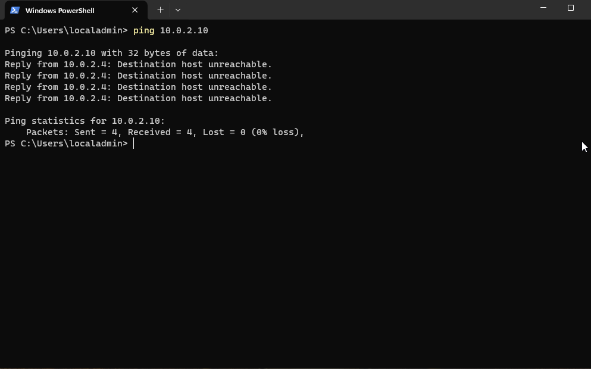
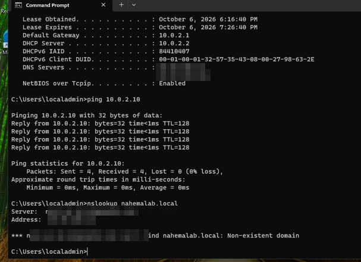
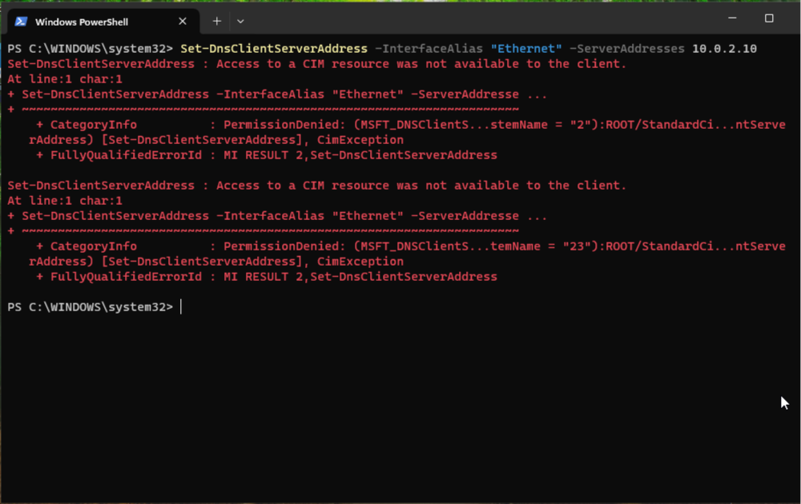
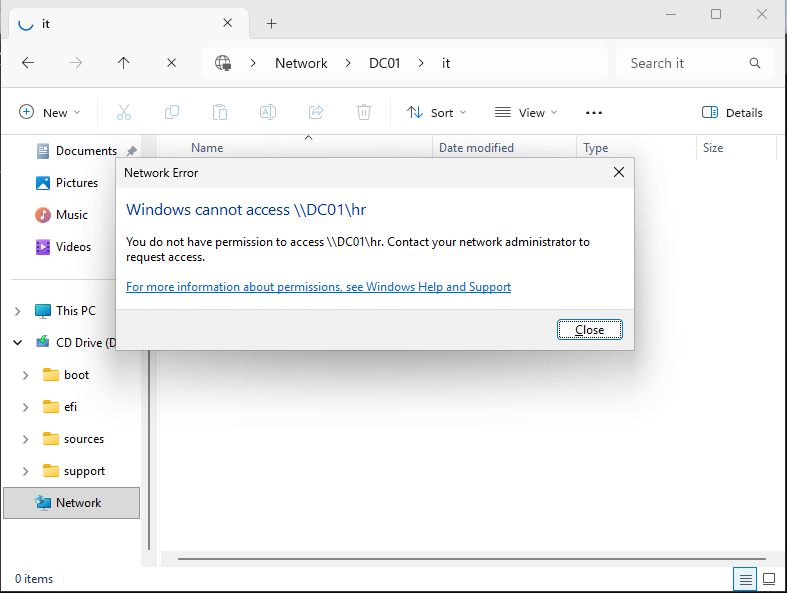
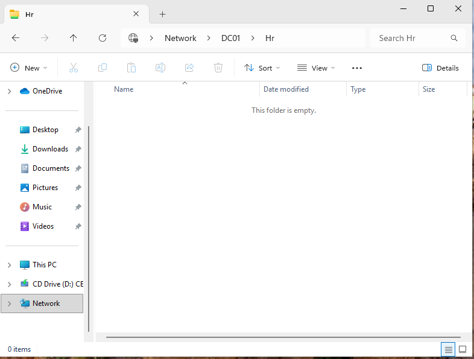

# Part 7: Joining an Employee PC to the Domain

## Dilemma: We have a company with users and folders, but no actual employee computer to log into.
## Objective: Build a Windows 11 PC, join it to nahemalab.local, and log in as a real employee.

Steps

1) First we create a new VM called CLIENT01 with the Windows 11 Enterprise ISO, 4 GB RAM, 2 CPUs and a 64 GB disk (Windows 11's minimum), and plug it into the same NAT Network "ADLab" as DC01.

2) During setup, Windows pushes a Microsoft account. Instead we pick Sign in options > Domain join instead and make a local account called localadmin. This is the PC's own backup key for IT, not an employee.

** Why not a personal Microsoft account? It belongs to the person, not the company. IT couldn't control it, files could sync to their personal OneDrive, and you can't shut it off when they quit. Companies use domain accounts (or work accounts in Entra ID) instead.

3) Before joining, we need CLIENT01 to use DC01 as its DNS server. I set it under Ethernet > IPv4 to 10.0.2.10 and left the IP itself on automatic, since employee PCs are fine with DHCP.

** Pointing DNS at DC01 isn't just a naming thing. When a PC joins or logs in, it asks DNS "where's the domain controller for nahemalab.local?" Only DC01's DNS knows the answer.

# Troubleshooting: Three Problems Before It Worked

** Problem 1: ping said "Destination host unreachable."
Windows counted the replies as received, but they came from CLIENT01 itself (10.0.2.4) saying it couldn't find 10.0.2.10. The cause? DC01 was paused in VirtualBox. Lesson: step one of troubleshooting is always "is the server even on?"

** Problem 2: the DNS setting didn't stick.
Even after setting it in the GUI, ipconfig /all still showed my ISP's DNS (covered up). Running nslookup proved it: my ISP's server answered "Non-existent domain" because it's never heard of my lab. Notice the ping works fine here, since ping uses the IP directly and DNS isn't involved.

** Problem 3: PowerShell said "Access to a CIM resource was not available."
I tried fixing DNS with a command, but the window wasn't running as admin. A real admin window's title says "Administrator." Lesson: access denied on system settings usually means you're not elevated.

Fix that finally worked, in PowerShell run as administrator:
   terminal> Set-DnsClientServerAddress -InterfaceAlias "Ethernet" -ServerAddresses 10.0.2.10
   (means: on the Ethernet adapter, use DC01 as the phonebook)

# Joining and Testing

4) Now we join. Windows key + R > sysdm.cpl > Change, name it CLIENT01, pick Domain, type nahemalab.local, and approve with NAHEMALAB\Administrator. Only IT can add PCs to the domain, so this is IT showing its badge. DC01 then creates a computer account for CLIENT01.

5) After a restart, we log in as Guts (NAHEMALAB\gstruggler). He's forced to set a new password, which is the onboarding setting from earlier working from the employee's side.

6) Great, now we test the locks. Guts is in IT, so \\DC01\IT opens. But \\DC01\HR gets blocked.

7) To prove it's not just blocking everyone, we log in as Jon Snow from HR, and \\DC01\HR opens.

** Network discovery stayed off. You don't need it to reach a share, since typing \\DC01\HR goes straight to the server by name. Plenty of companies keep it off so PCs aren't advertising themselves.

# Conclusion

At this point BehelitTech works like a real small office. There's a server running the domain, an employee PC joined to it, and users who can log in from any company computer with one account. Shared folders let each department in while keeping everyone else out.

What I took away from this part
- Every domain PC has to use the domain controller for DNS, or it can't find the domain at all
- Ping and nslookup are net tools for dns config issues
- "Access denied" on system settings usually means you're not running as admin

Now With a working domain, users and a joined PC, the lab is ready for real help desk tickets.
