# Part 8: Setting Up a Ticketing System

## Dilemma: BehelitTech now has users, departments and shared folders, which means things will break. Right now there's no way for employees to report problems and no record of what IT fixed or how. Without that, issues get lost, the same problems keep coming back, and nobody knows what's been tried.
## Objective: Build a simple ticketing system so every problem gets logged, sorted by urgency, worked step by step and documented, the same way a real help desk runs.

Purpose for today
- Set up a ticketing workflow using GitHub Issues
- Create labels so every ticket is sorted the same way
- Build a ticket template so every report collects the same key info
- Work real tickets from start to finish: report, investigate, fix, verify, document

Steps

1) First we need a place for tickets to live. I'm using GitHub Issues in this repo. Real companies use tools like ServiceNow or Zendesk, but the workflow is the same: a ticket comes in, gets sorted, gets worked, gets closed.

2) Next we need a way to sort tickets at a glance. I created labels that answer three questions about every ticket:

   How urgent is it? (Priority)
   P1-critical: whole company or a key system is down, fix now
   P2-high: several people can't work, fix today
   P3-medium: one person has a problem but can still mostly work
   P4-low: small issue, fix when there's time

   Who should handle it? (Tier)
   tier-1: help desk can solve it, like password resets or folder access
   tier-2: needs a more senior IT person, like server or network changes

   What kind of problem is it? (Category)
   access: anything about getting in, like logins, passwords, lockouts, new or removed users, or folders and files they can't open
   device: computer, laptop, printer or other equipment
   network: can't connect to the internet, server or other computers

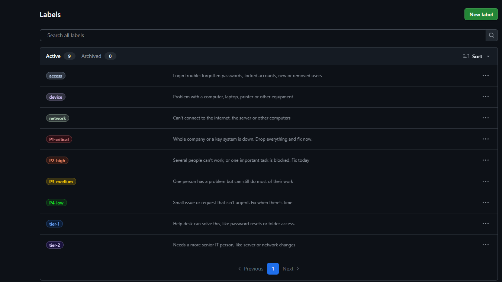

** Every ticket gets one label from each group. For example, "forgot my password" is P3 + tier-1 + access. Tier and category are separate because the same kind of problem can need different people. A single forgotten password is tier 1, but if the server itself stops accepting logins, that's still an access problem but it becomes tier 2.

3) Last, we need every ticket to collect the same info so nothing gets missed. I made a ticket template that asks for full name, username (what I search for in Active Directory), department, device, contact method, the issue in the user's own words, and priority, tier and category. Notes, resolution and root cause get filled in at the end.

** I kept the template plain on purpose. Real tickets are short and written fast. The step by step updates go in comments as I work, so each ticket builds up a timeline of what was checked and what fixed it. The body gets a short summary at the end so anyone skimming gets the answer.

** Root cause matters as much as the fix. Fixing one person's problem is good, but knowing WHY it happened stops the next ten tickets.

** Tickets come in through different channels: a portal, email, phone, chat or someone walking up. No matter how, every request becomes a ticket. "No ticket, no work."

# Ticket #1: Can't Save Files in HR Folder (Incident)

## Dilemma: Jon Snow from HR emailed saying he can open the HR folder but gets "access denied" when he tries to save or create a file. He needs to update the onboarding checklist today.
## Objective: Find out why Jon can read but not write, fix it, and make sure it doesn't happen to other departments.

P3-medium / tier-1 / access

1) First rule of any ticket: see the problem for yourself. I logged into CLIENT01 as Jon Snow.

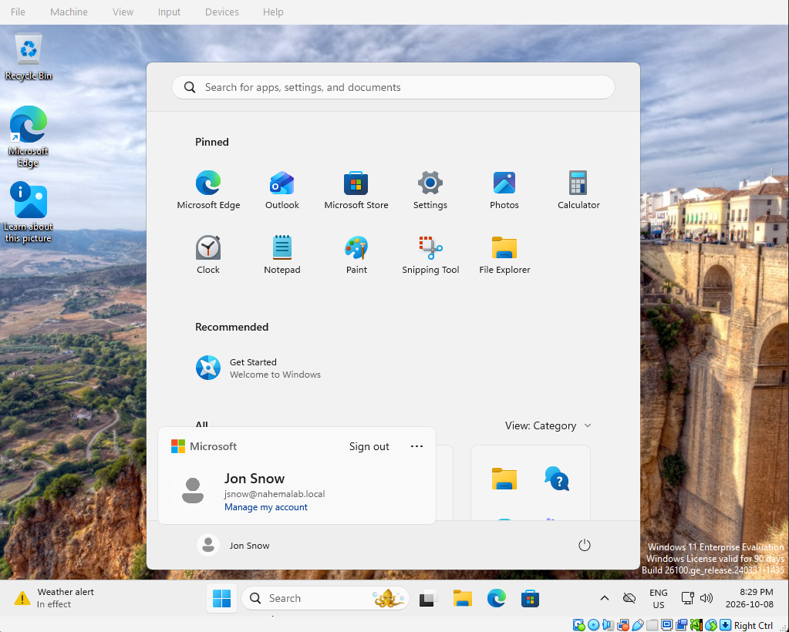

2) He could open \\DC01\HR fine, but creating a new file failed. So he has read access but not write.

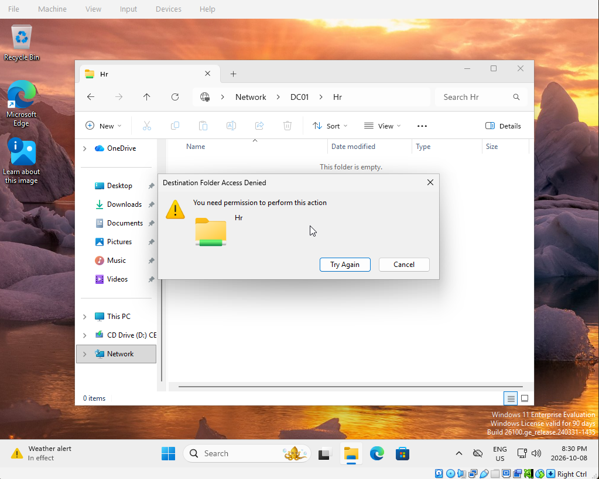

3) Next we check both locks on the folder. NTFS (Security tab) gave HR-staff Modify, which is correct. But the share permissions (Sharing tab) only had Read ticked.

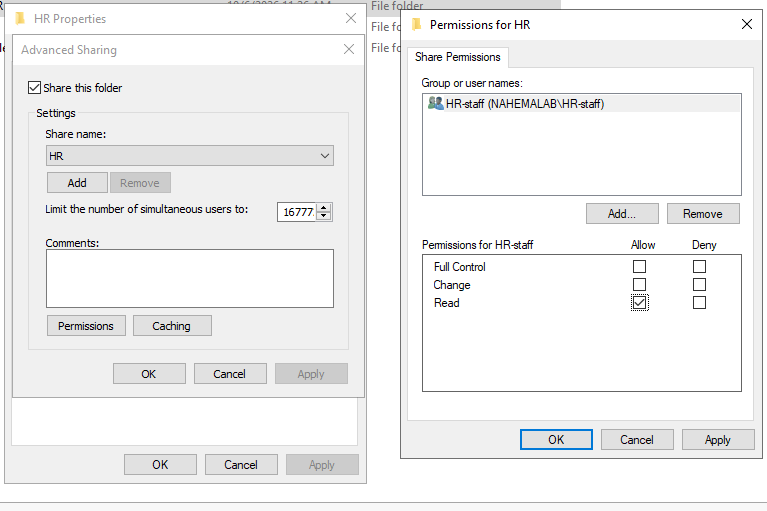

** Windows checks two locks: share permissions (the front door, for network access) and NTFS permissions (the office door, for the files on disk). The user gets whichever is stricter. Share said Read, NTFS said Modify, so Read won.

4) The fix: give HR-staff Change on the share. I did NOT give Full Control, since that would let regular staff change who has access to the folder. That breaks least privilege.

5) Back on CLIENT01 as Jon, he could now create a folder in HR.

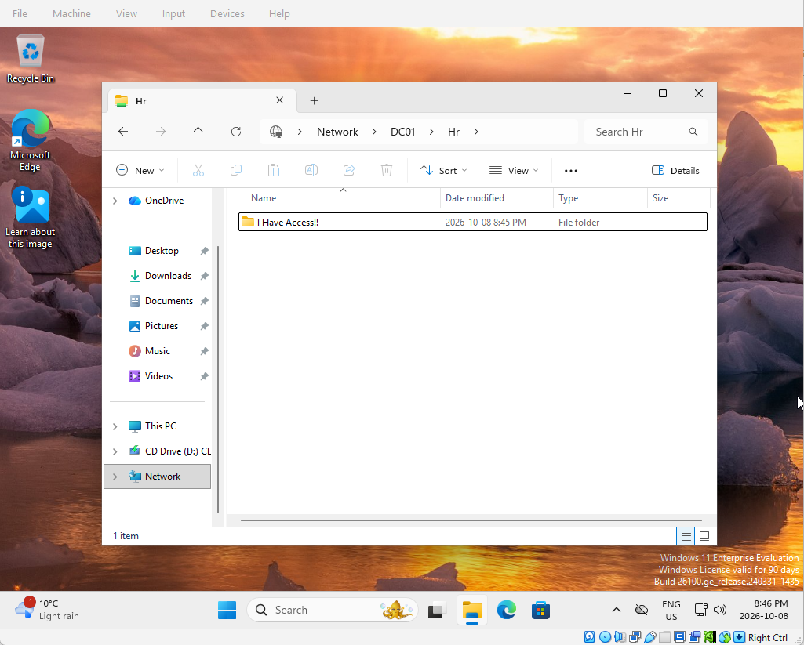

6) When you find a mistake, check for the same mistake elsewhere. I checked the IT and Sales shares too.

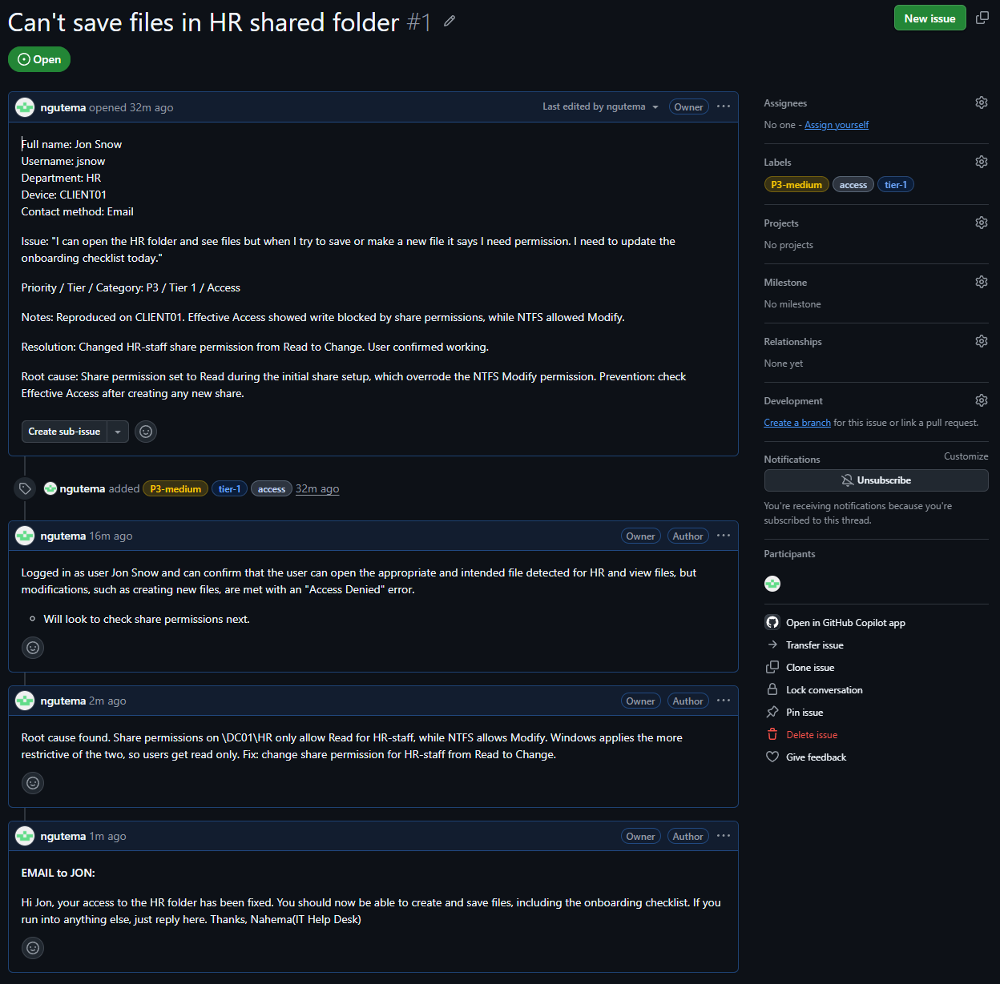

# Ticket #2: Forgot Password (Incident)

## Dilemma: Light Yagami called in after vacation. He forgot his password and can't log in.
## Objective: Reset his password safely, without giving an attacker an easy way in.

P3-medium / tier-1 / access

1) Before touching the account, verify who's calling. Anyone can phone in pretending to be Light, and help desks are a favourite target for exactly this. I called back the number on file before making any changes.

2) Then we find Light in Active Directory under the IT OU.

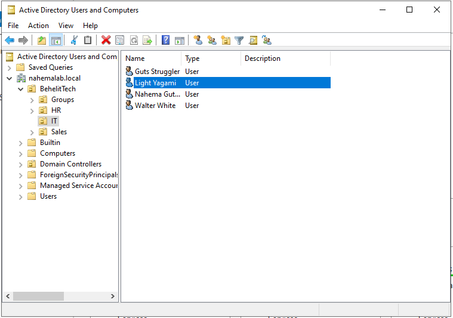

3) Right click > Reset Password. I set a temporary password and ticked "User must change password at next logon," so the temp password only works once and IT never knows his real one.

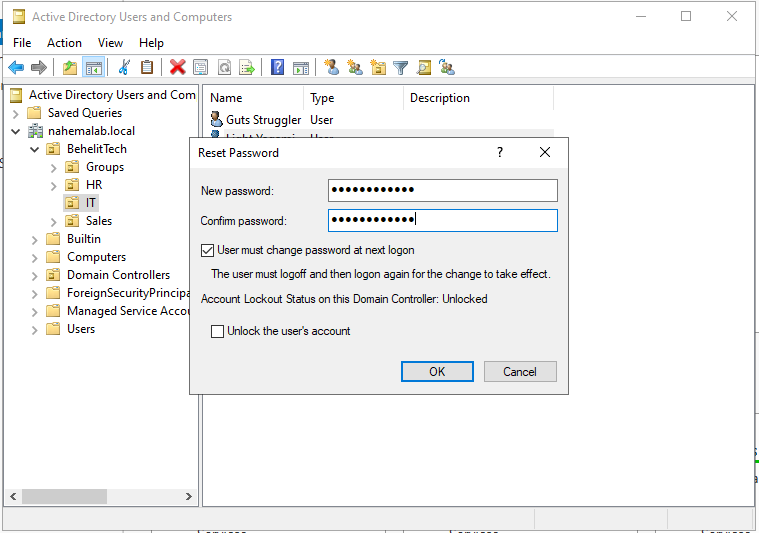

** The temp password never goes in the ticket. Tickets are seen by lots of people. I gave it to Light verbally over the verified phone call.

4) On CLIENT01, Light signed in with the temp password and was forced to pick a new one.

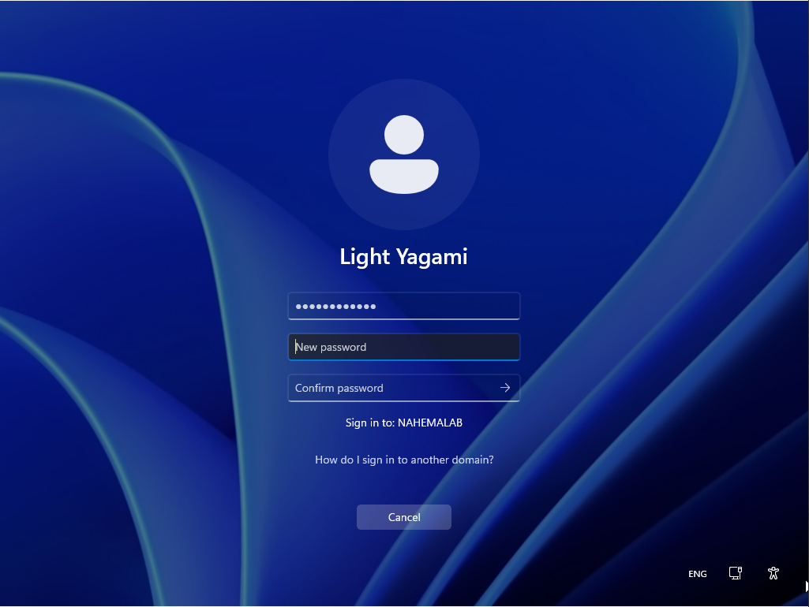

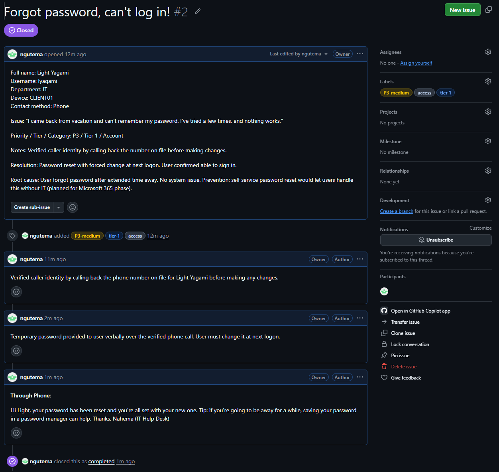

# Ticket #3: Move CLIENT01 into BehelitTech (Service Request)

## Dilemma: CLIENT01 joined the domain but landed in the default Computers container. Containers can't receive Group Policy, so any rules we make for company PCs would skip it.
## Objective: Create a proper home for company workstations and move CLIENT01 into it.

P4-low / tier-1 / device

** Not every ticket is something broken. Incidents are when something breaks (Jon, Light). Service requests are routine work or tasks, like this one. Real help desks track both.

1) Here's CLIENT01 sitting in the default Computers container.

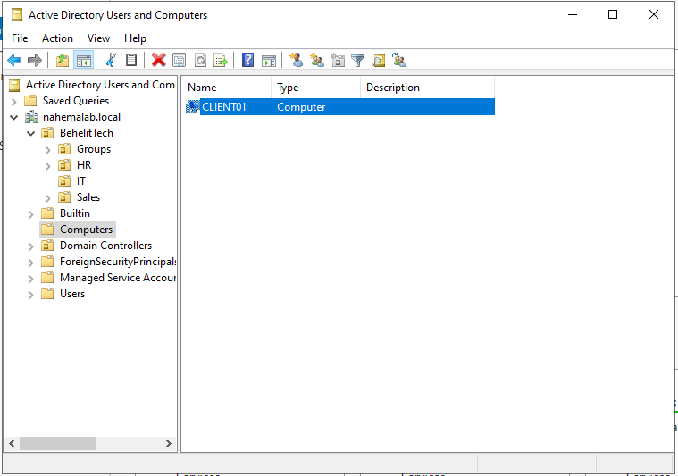

2) We create a Workstations OU inside BehelitTech and move CLIENT01 into it. Keeping PCs separate from users lets us aim computer rules (like screen lock or updates) at machines only.

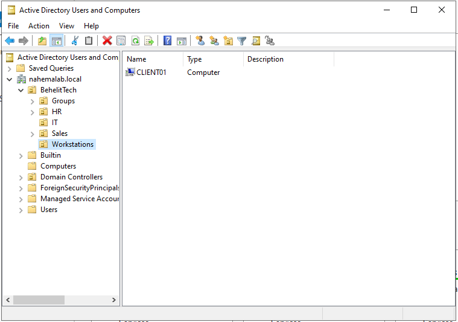

3) To verify, in PowerShell on DC01:
   terminal> Get-ADComputer CLIENT01
   The DistinguishedName now shows OU=Workstations,OU=BehelitTech.

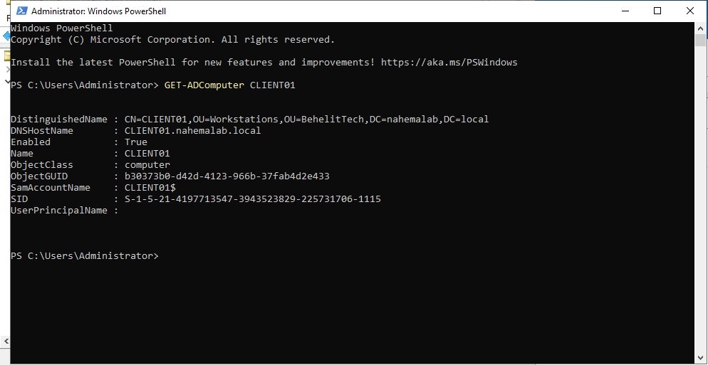

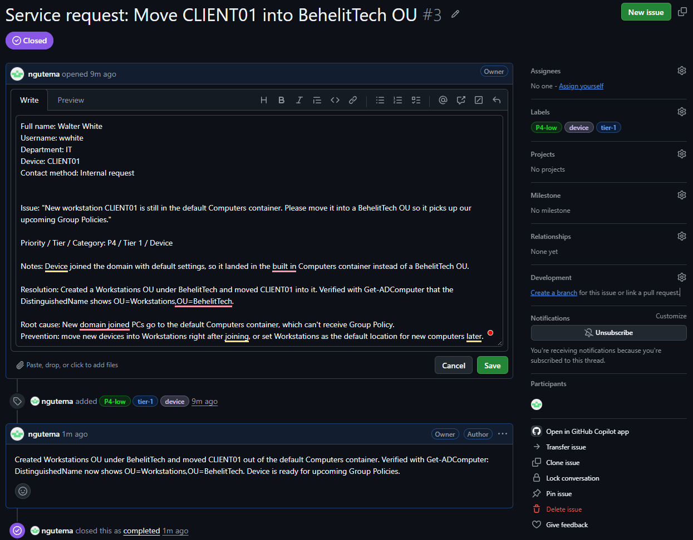

# Wrapping Up

These three tickets cover some of the most common day to day help desk work: fixing folder permissions, resetting a password safely, and keeping devices organized in Active Directory. None of them are complicated on their own, but each one followed the same full process a real help desk uses: log it, reproduce it, find the root cause, fix it, verify it, tell the user and document it.

What I took away from today
- Always see the problem yourself before changing anything
- Check both share and NTFS permissions, since the stricter one wins
- Verify who's calling before touching any account
- Never write passwords in a ticket
- When you find one mistake, look for the same mistake elsewhere
- Not every ticket is something broken. Service requests matter too.

** The fix is usually the quick part. Writing down the root cause is what keeps the same ticket from coming back next week.

What's next
These tickets used tools that were already set up. Next I'll add Group Policy, which brings new things that can break: account lockouts, missing mapped drives and settings that don't apply. That means more realistic tickets to work.
